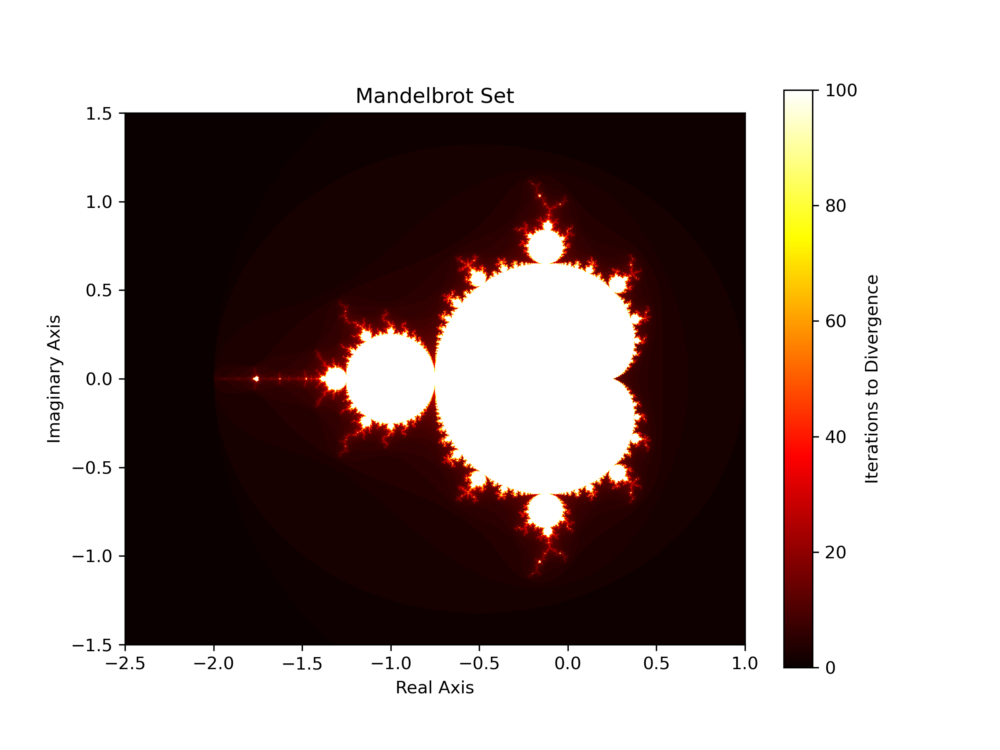
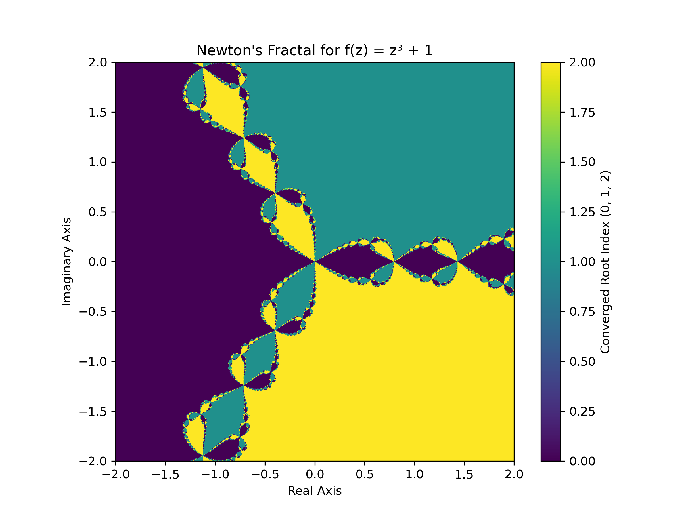
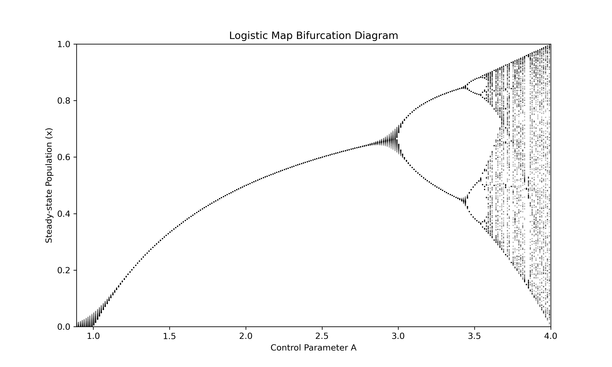
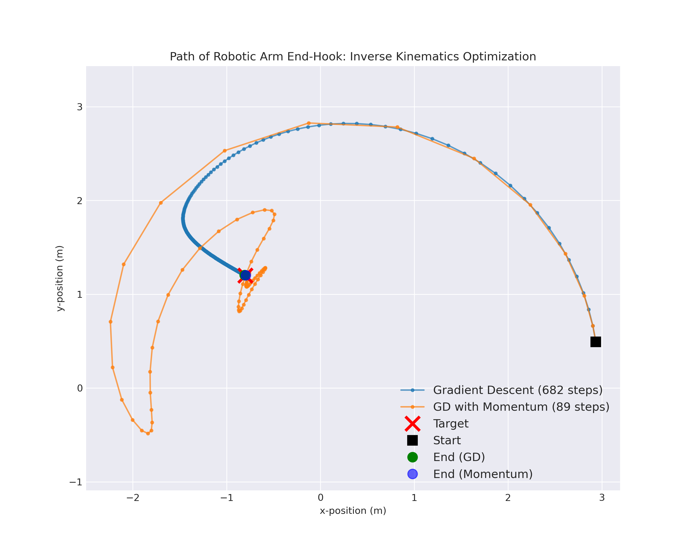

# Numerical Methods & Computational Dynamics Portfolio

This repository is a collection of computational mathematics projects exploring complex deterministic systems, fractal geometry, and numerical optimization. It includes vectorized Python implementations for visualizing standard fractals, analyzing the onset of mathematical chaos, and solving inverse kinematics using first-order derivative optimization.

---

## Module 1: Chaotic Dynamics and Fractal Boundaries

This module explores how complex, deterministic nonlinear systems give rise to chaotic behavior and fractal geometry. 

### 1. The Mandelbrot Set
The Mandelbrot set is generated using fixed-point iteration on the complex plane. For a given complex number $c$, we iterate the sequence:
$$z_{n+1} = z_{n}^{2} + c$$
starting with $z_{0} = 0$. If the sequence remains bounded (i.e., $|z_{n}| \le 2$), the point belongs to the set. The engine iterates over a $1000 \times 1000$ complex grid, mapping the escape velocity of points that diverge.



### 2. Newton's Fractal
Applying the Newton-Raphson method to find the roots of complex functions yields intricate fractal boundaries between basins of attraction. For the function $f(z) = z^3 + 1$, the iterative update is:
$$z_{n+1} = z_{n} - \frac{f(z_{n})}{f^{\prime}(z_{n})}$$
Depending on the starting value, the iteration converges to one of three complex roots ($\omega_{0}, \omega_{1}, \omega_{2}$). The visualization maps the complex plane based on the final converged root, revealing a self-similar fractal boundary.



### 3. Logistic Map & Chaos
To observe the onset of chaos through period-doubling bifurcations, this module models the logistic map:
$$x_{n+1} = A x_{n}(1 - x_{n})$$
For small values of the control parameter $A$, the sequence settles to a stable fixed point. As $A$ increases, the system undergoes bifurcations leading to periodic oscillations and eventually deterministic chaos.



### 4. Lyapunov Exponents
A key quantity characterizing chaotic dynamics is the Lyapunov exponent ($\lambda$), which measures the average exponential rate at which nearby trajectories diverge. For a discrete map, the finite-time Lyapunov exponent is:
$$\lambda_{n} = \frac{1}{n}\sum_{k=0}^{n-1}\ln|f^{\prime}(x_{k})|$$
For $A=4$, the exponent evaluates to a positive constant ($\approx \ln 2$), proving extreme sensitivity to initial conditions and confirming the chaotic nature of the system.

---

## Module 2: Kinematic Optimization (Robotic Arm)

This module implements numerical optimization techniques to solve the inverse kinematics problem for a **3-link planar robotic manipulator**. Given a desired target position for the end-effector, the algorithm computes the necessary joint angles using first-order derivative optimization.

### Forward Kinematics & Objective Function
The position $\boldsymbol{p}(\boldsymbol{\theta})$ of the end-hook is determined by the joint angles $\boldsymbol{\theta} = [\theta_1, \theta_2, \theta_3]^T$. To reach the target position $\boldsymbol{p_t}$, we minimize the squared Euclidean distance loss function:
$$L(\boldsymbol{\theta}) = \frac{1}{2} \|\boldsymbol{p}(\boldsymbol{\theta}) - \boldsymbol{p_t}\|^2$$

The gradient $\boldsymbol{\nabla} L(\boldsymbol{\theta})$ is approximated computationally using the central difference method.

### Optimization Algorithms
The module compares two iterative solvers to traverse the loss landscape:

**1. Vanilla Gradient Descent**
Updates the joint angles strictly in the direction of steepest descent, governed by the learning rate $\alpha$:
$$\boldsymbol{\theta_{k+1}} = \boldsymbol{\theta_k} - \alpha \boldsymbol{\nabla} L(\boldsymbol{\theta_k})$$

**2. Gradient Descent with Momentum**
Introduces a velocity term $\boldsymbol{v}$ to accumulate gradients over time. This helps to navigate shallow gradients and accelerate convergence, governed by the momentum coefficient $\beta$:
$$\boldsymbol{v_{k+1}} = \beta \boldsymbol{v_k} + \alpha \boldsymbol{\nabla} L(\boldsymbol{\theta_k})$$
$$\boldsymbol{\theta_{k+1}} = \boldsymbol{\theta_k} - \boldsymbol{v_{k+1}}$$



---

## Setup & Usage

1. Clone this repository:
   ```bash
   git clone [https://github.com/coder-r2/Numerical-Methods-Portfolio.git](https://github.com/your-username/Numerical-Methods-Portfolio.git)
2. Install the required dependencies
    ``` bash
    pip install numpy matplotlib
3. Navigate to the desired module and run the visualization scripts to generate the plots:
    ``` bash
    cd fractal-dynamics
    python visualize.py